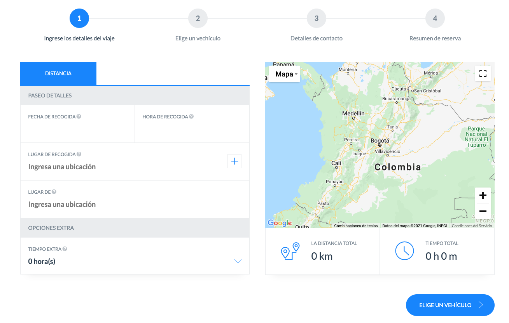
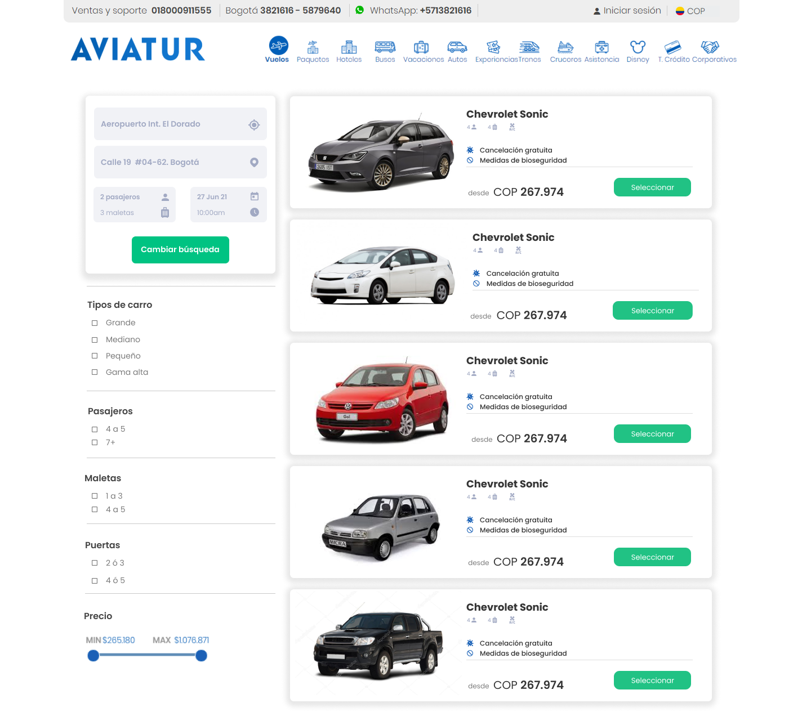

## Introducción

El servicio de transporte corresponde a una de las funcionalidades requeridas por el departamento de transportes en cabeza de la vicepresidencia de operaciones

## Alcance

Ofrecer servicios de transportes nacional e internacionales, en los diferentes canales de venta en línea con el fin de cotizar, reservar y confirmar, las tarifas se muestran en pesos.


## Referentes

https://travelevents.com.co/reservar/

## API

Estructura de parametros de búsqueda:

```shell
{
  "search": [
    {
      "date": {
        "arrival": "2021-09-01T01:07:29.845Z"
      },
      "locations":[
        {
          "description":"Bogota airport",
          "location":{
            "latitude": 4.7009718,
            "longitude": -74.1482912
          }
        },
        {
          "description":"Bogota chapinero",
          "location":{
            "latitude": 4.5992835,
            "longitude": -74.0709949
          }
        }  
      ],
      "hours":{
        "count":1,
        "extra":3
      },
      "distance":{
        "measure":"Kmh",
        "amout": 2,5
      }

    }
  ],
  "service": [
    {
      "id": "carro",
      "category": {
        "value": "fixed"
      },
      "value": 10000000,
      "cantity": {
        "passengers": 4,
        "baggage": 4
      }
    }
  ]
}
```

captura de ejemplo



Estructura de listado de autos:

```shell
{
  "cars": [
    {
      "id":"SEDWHITE3DOORS"
      "name": "Sedán Básico",
      "category": "sedan",
      "cantity": {
        "passengers": 3,
        "baggage": 3
      },
      "conditions":{
        "smoke": false ,
        "drinking": false ,
        "eating": true ,
        "biosecurity": true
      },
      "type": "diesel",
      "doors":4,
      "price":{
        "fixed": 100000,
        "base": 810000,
        "tax": 19000,
        "kmh": 1000
      },
      "imgs":[
        "http://cdn.travelevents.com.co/cars/small/{CATEGORY}/{ID}.png",
        "http://cdn.travelevents.com.co/cars/medium/{CATEGORY}/{ID}.png",
        "http://cdn.travelevents.com.co/cars/big/{CATEGORY}/{ID}.png"
      ]
    }
  ]
}
```

captura de ejemplo de resultados



Estructura de ejercicio de reservar

```shell
{
  "service": [
    {
      "id": "1234",
      "transaction":{
        "id":"TRANSACTIONID",
        "date":"2021-09-01T01:07:29.845Z",
        "geolocation":{
          "neighborhood": "Candelaria",
          "city": "Bogota",
          "countrycode": "CO",
          "postalCode": "111711",
          "lat": 4.59929,
          "lng": -74.071005
        }
      }
      "car":{
        "id":"SEDWHITE3DOORS",
      }
      "category": {
        "value": "fixed"
      },
      "value": 10000000,
      "biller":{
        "document":{
          "type":"CC",
          "number":10182222222
        },
        "name":{
          "first":"Joe",
          "last":"Doe"
        },
        "birthdate":"2000-09-01T01:07:29.845Z",
        "email":"joedoe@example.com",
        "phone":{
          "indicative":"57",
          "number":"3212833333"
        },
        "nacionality":"CO"
      },
      "passengers": {
        "number": 2,
        "info":[
          {
            "document":{
              "type":"CC",
              "number":10182222222
            },
            "type":"ADT",
            "name":{
              "first":"Joe",
              "last":"Doe"
            },
            "birthdate":"2000-09-01T01:07:29.845Z",
            "email":"joedoe@example.com",
            "phone":{
              "indicative":"57",
              "number":"3212833333"
            },
            "nacionality":"CO"
          },
          {
            "document":{
              "type":"CC",
              "number":10182222222
            },
            "type":"CHD",
            "name":{
              "first":"Joe",
              "last":"Doe"
            },
            "birthdate":"2000-09-01T01:07:29.845Z",
            "email":"joedoe@example.com",
            "phone":{
              "indicative":"57",
              "number":"3212833333"
            },
            "nacionality":"CO"
          }
        ]
      },
      "comments":"Lorem ipsum dolor sit amet, consectetur adipisicing elit"
    }
  ]
}
```


## Canales de venta


- `https://aviatur.com`
- `agencias administradas`
- `front del asesor`
